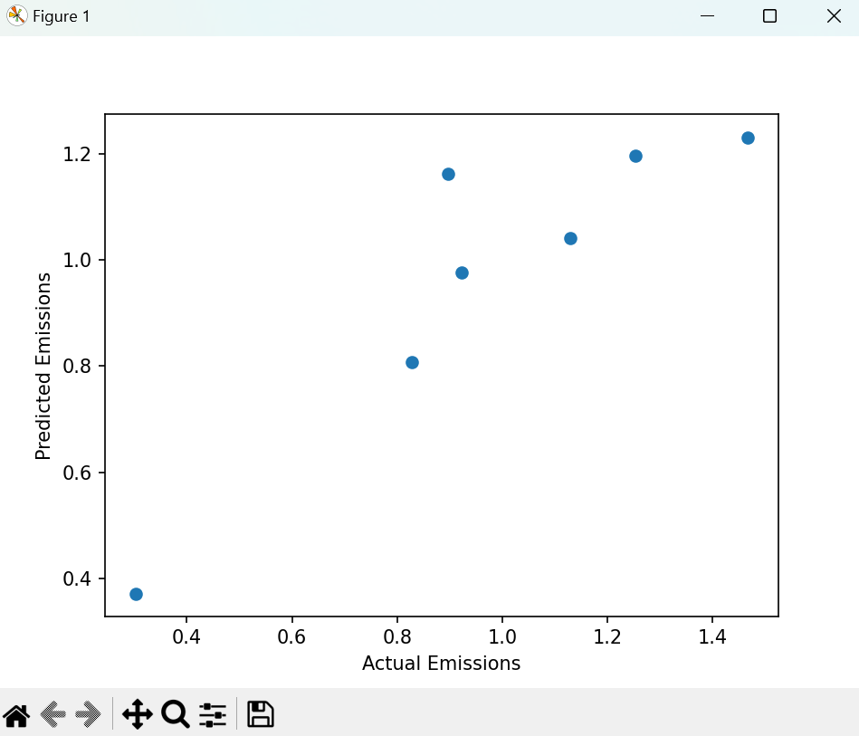

# predictive_model

## Project Overview
This project demonstrates the process of data collection, cleaning, and preprocessing for a machine learning application. The dataset used is related to world energy consumption and CO2 emissions. The goal is to showcase skills in handling real-world data and preparing it for machine learning models.
**Outcome:** Improved decision-making by providing actionable insights that contributed to reducing carbon emissions.


The primary steps in this project include:
1. **Data Loading**: Importing data from a CSV file.
2. **Data Cleaning**: Removing irrelevant rows and columns, handling missing values.
3. **Data Preprocessing**: Converting data types, normalizing features, and preparing target variables.
4. **Visualization**: Plot the predicted data

## Steps

### 1. Data Loading

The dataset is loaded from a CSV file using pandas. The initial step involves examining the dataset to understand its structure and content.
Used pandas to load the data

### 2. Data Cleaning
Remove the first row as it contain string value that we don't need.
And prepare it for the model to be predicted


## 3. Data Preprocessing
### Machine Learning Model for CO2 Emissions Prediction

This section describes the steps involved in building and evaluating a machine learning model to predict CO2 emissions using a Random Forest Regressor. The model is trained on the preprocessed energy consumption data and evaluated using performance metrics.

## Steps

### 1. Import Libraries

We start by importing the necessary libraries for data processing, model training, evaluation, and visualization.

```python
from sklearn.model_selection import train_test_split
from sklearn.ensemble import RandomForestRegressor
from sklearn.metrics import mean_squared_error, r2_score
import matplotlib.pyplot as plt
from utils import data_cleaning

train_test_split: Splits the data into training and testing sets.
RandomForestRegressor: The machine learning model used for regression.
mean_squared_error and r2_score: Metrics to evaluate model performance.
matplotlib.pyplot: For visualizing results.
```

# Define the Model Function
The model function handles the following steps:

Data Loading: Calls the data_cleaning.cleaning() function to load and preprocess the data.
Train-Test Split: Divides the data into training and testing sets.
Model Training: Trains a Random Forest Regressor model on the training data.
Prediction: Predicts CO2 emissions on the test data.
Evaluation: Computes Mean Squared Error (MSE) and R² score to evaluate model performance.

## 4. Visualization
### Visualization Function 
Displays a scatter plot of actual vs. predicted emissions.
T he visualization function plots the actual vs. predicted CO2 emissions to visually assess the model's performance.

Scatter Plot: Creates a scatter plot where the x-axis represents actual emissions and the y-axis represents predicted emissions.
Labels: Adds labels to the axes for clarity.

## Run the Model
To execute the model, run the following command:
cd into the model folder and run python preditive_model.py
This will train the model, evaluate its performance, and display a visualization of the results.

# Results
The output includes:

Mean Squared Error (MSE): Measures the average squared difference between actual and predicted values.
R² Score: Indicates the proportion of the variance in the dependent variable that is predictable from the independent variables.
Scatter Plot: Provides a visual representation of how well the model's predictions match the actual values.
